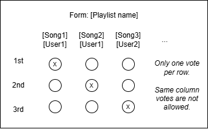
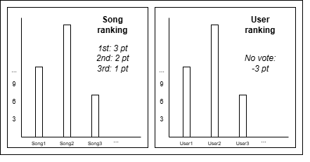

# song-derby

Helper application to fetch Spotify's playlist information and assist in creating the structure of a gamified process
for 'musical democracy'. Uses forms to ease the poll/voting process as well as diagrams accompanying the results for
easier interpretation.

## Authors

- Óscar Kirschstein Schafer
- Ignacio Montes Álvarez

## Installation and usage

Virtual environment setup for Debian-based distros. Uses Python 3.12.

1. `sudo add-apt-repository ppa:deadsnakes/ppa && sudo apt-get update`
2. `sudo apt-get install python3.12`
3. `sudo apt install python3.12-venv`
4. `python3.12 -m venv .venv`
5. `source .venv/bin/activate.sh` (for `bash` or `zsh`)
6. `python -m pip install -r requirements.txt`

## Code practices

- Use `black` to format the code with line length set to 100: `python -m black -l 100` (or in deference set it up to automagically format it with your IDE on code save).
- Use Google-style docstrings: https://sphinxcontrib-napoleon.readthedocs.io/en/latest/example_google.html

## Roadmap

### v0 (MVP)

- Human-in-the-loop
  - Generate form
  - Generate diagram

### v1

- Automatization
  - Schedule
    - Generate form
    - Generate diagram
- Send (WhatsApp/Telegram bot)
  - Form
  - Diagram

### v2

- Embedded form (WhatsApp/Telegram bot)
  - Skip Google Forms step (all internal in the bot)

### v3?

- Programming language port (experimental): GOLang, Rust...

## MVP Tasks

**Every step requires human-in-the-loop invocation**

1. Using Python and the Spotify API get playlist's information (https://developer.spotify.com/documentation/web-api/reference/get-playlist)
   1. Playlist name
   2. List of songs
   3. Mapping of usernames to songs
   4. Timestamps for additions: used to filter-out information upon invocation for collection (no overlap with previous execution, only new data)
   5. (Save to file format, or DataFrame with `pandas`)

2. Using Python (and data from last step) and the Google Forms API create a form  (https://developers.google.com/forms/api/reference/rest/v1/forms/create and https://developers.google.com/forms/api/reference/rest/v1/forms#Form)
    1. Request e-mail (construct Spotify's username to e-mail mapping?) for identification
    2. Follow template below (between square brackets is the information expected to be present from previous step):
   

3. Using Python and the Google Forms API collect the answers from (2.) (https://developers.google.com/forms/api/reference/rest/v1/forms.responses/list and https://developers.google.com/forms/api/reference/rest/v1/forms.responses#FormResponse)
   1. Can collect e-mails of respondents for identification (mapping Spotify's usernames to e-mails?)
   2. Generate a diagram with all the information taking into consideration the following template (e.g., `matplotlib`):
   
